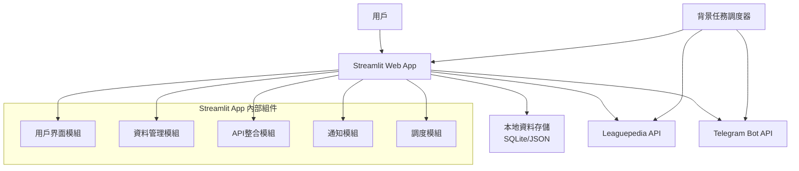

# Design Document

## Overview

LOL比賽通知系統採用簡化的單體架構，使用Streamlit作為主要應用框架。系統整合Leaguepedia API來獲取比賽資料，並透過Telegram Bot API發送通知。所有功能都在單一Streamlit應用中實現，包括用戶界面、資料處理和通知邏輯。

## Architecture

### 系統架構圖



### 技術棧

- **前端**: Streamlit (Python web framework)
- **資料存儲**: SQLite 或 JSON 檔案 (輕量級本地存儲)
- **外部API**: 
  - Leaguepedia API (比賽資料)
  - Telegram Bot API (通知發送)
- **任務調度**: APScheduler (Python背景任務)
- **HTTP客戶端**: requests 或 httpx

## Components and Interfaces

### 1. 用戶界面模組 (UI Module)

**職責**: 提供Streamlit網頁界面供用戶互動

**主要功能**:
- 戰隊選擇和訂閱界面
- 訂閱管理頁面
- 系統狀態顯示

**介面**:
```python
class UIModule:
    def render_team_subscription_page()
    def render_subscription_management_page()
    def render_system_status_page()
    def display_notification_history()
```

### 2. 資料管理模組 (Data Manager)

**職責**: 管理用戶訂閱資料和比賽資料的本地存儲

**主要功能**:
- 用戶訂閱資料的CRUD操作
- 比賽資料的本地快取
- 資料持久化

**介面**:
```python
class DataManager:
    def save_subscription(user_id: str, teams: List[str])
    def get_user_subscriptions(user_id: str) -> List[str]
    def update_subscription(user_id: str, teams: List[str])
    def delete_subscription(user_id: str)
    def cache_match_data(matches: List[Match])
    def get_cached_matches() -> List[Match]
```

### 3. API整合模組 (API Integration)

**職責**: 與外部API進行通訊

**主要功能**:
- Leaguepedia API資料獲取
- 資料解析和格式化
- 錯誤處理和重試機制

**介面**:
```python
class LeaguepediaAPI:
    def get_upcoming_matches(days: int = 2) -> List[Match]
    def get_team_list() -> List[Team]
    def get_match_details(match_id: str) -> Match

class TelegramAPI:
    def send_notification(user_id: str, message: str) -> bool
    def validate_bot_token() -> bool
```

### 4. 通知模組 (Notification Module)

**職責**: 處理通知邏輯和訊息格式化

**主要功能**:
- 比賽通知訊息生成
- 通知發送邏輯
- 發送狀態追蹤

**介面**:
```python
class NotificationManager:
    def create_match_notification(match: Match) -> str
    def send_notifications_for_match(match: Match)
    def get_subscribers_for_team(team: str) -> List[str]
    def retry_failed_notifications()
```

### 5. 調度模組 (Scheduler Module)

**職責**: 管理背景任務和定時作業

**主要功能**:
- 定期獲取比賽資料
- 檢查即將開始的比賽
- 發送定時通知

**介面**:
```python
class SchedulerManager:
    def start_background_tasks()
    def schedule_match_data_fetch()
    def schedule_notification_check()
    def stop_all_tasks()
```

## Data Models

### 用戶訂閱模型
```python
@dataclass
class UserSubscription:
    user_id: str  # Telegram用戶ID
    telegram_username: str
    subscribed_teams: List[str]
    created_at: datetime
    updated_at: datetime
    is_active: bool = True
```

### 戰隊模型
```python
@dataclass
class Team:
    team_id: str
    name: str
    region: str
    league: str
    logo_url: Optional[str] = None
```

### 比賽模型
```python
@dataclass
class Match:
    match_id: str
    team1: Team
    team2: Team
    scheduled_time: datetime
    tournament: str
    match_format: str  # BO1, BO3, BO5
    status: str  # scheduled, live, completed
    stream_url: Optional[str] = None
```

### 通知記錄模型
```python
@dataclass
class NotificationRecord:
    notification_id: str
    user_id: str
    match_id: str
    message: str
    sent_at: datetime
    status: str  # sent, failed, pending
    retry_count: int = 0
```

## Error Handling

### API錯誤處理策略

1. **Leaguepedia API錯誤**:
   - 連接超時: 重試3次，間隔遞增
   - 速率限制: 實施退避策略
   - 資料格式錯誤: 記錄錯誤並使用快取資料

2. **Telegram API錯誤**:
   - 訊息發送失敗: 重試機制，最多3次
   - 無效用戶ID: 標記訂閱為無效
   - Bot token錯誤: 系統警告並停止通知服務

3. **資料存儲錯誤**:
   - 檔案讀寫錯誤: 建立備份機制
   - 資料損壞: 實施資料驗證和修復

### 錯誤日誌系統

```python
import logging

# 設定多層級日誌
logging.basicConfig(
    level=logging.INFO,
    format='%(asctime)s - %(name)s - %(levelname)s - %(message)s',
    handlers=[
        logging.FileHandler('lol_notification.log'),
        logging.StreamHandler()
    ]
)
```

## Testing Strategy

### 單元測試

1. **資料管理模組測試**:
   - 訂閱資料的CRUD操作
   - 資料驗證邏輯
   - 快取機制

2. **API整合測試**:
   - Mock外部API回應
   - 錯誤處理邏輯
   - 資料解析正確性

3. **通知模組測試**:
   - 訊息格式化
   - 發送邏輯
   - 重試機制

### 整合測試

1. **端到端流程測試**:
   - 用戶訂閱 → 比賽資料獲取 → 通知發送
   - 錯誤情境下的系統行為

2. **外部依賴測試**:
   - 使用測試環境的Telegram Bot
   - Leaguepedia API的實際調用測試

### 測試工具

- **單元測試**: pytest
- **Mock**: unittest.mock 或 pytest-mock
- **測試資料**: fixtures 和 factory patterns
- **覆蓋率**: pytest-cov

## Performance Considerations

### 資料快取策略

1. **比賽資料快取**: 每30分鐘更新一次
2. **戰隊列表快取**: 每日更新一次
3. **用戶訂閱資料**: 即時更新，本地存儲

### 通知效能優化

1. **批次處理**: 將同一比賽的多個通知批次發送
2. **非同步處理**: 使用背景任務避免阻塞主應用
3. **速率限制**: 遵守Telegram API的速率限制

### 資源管理

1. **記憶體使用**: 限制快取資料大小
2. **網路請求**: 實施連接池和超時設定
3. **檔案I/O**: 使用適當的緩衝區大小